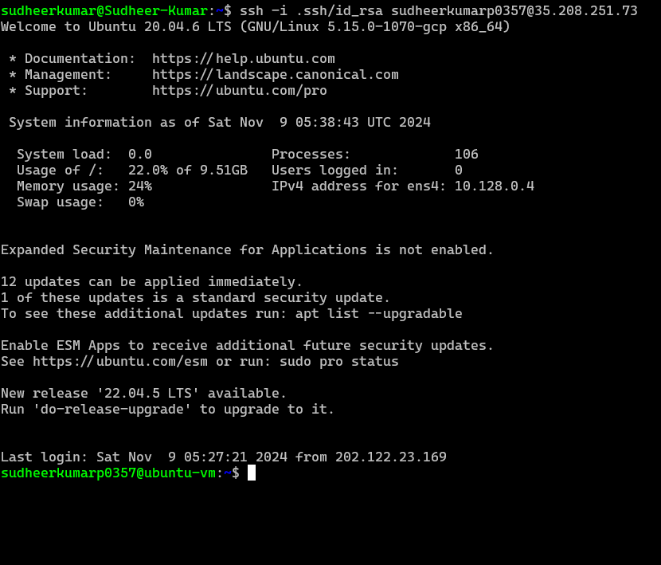

# Day 1: Linux Overview and Setup
## Tasks
1. **Understand Linux Distributions**:
   - Research different Linux distributions (Ubuntu, CentOS, Fedora) and document their use cases.
   - Choose and justify the best distribution for your needs (e.g., Ubuntu for user-friendliness).

2. **Install Ubuntu**:
   - Install Ubuntu on a virtual machine or set up a dual-boot system.
   - Document the installation steps for future reference.

3. **Familiarize with the Terminal**:
   - Open the terminal and execute basic commands like `ls`, `cd`, `pwd`, `echo`, and `man`.
   - Create a cheat sheet with these basic commands.

## Outcome
A functioning Ubuntu installation with basic command-line familiarity.

## Connect the Remote Server through the SSH
Create a Virtual Machine in any desired cloud provider or in your local machine using VirtualBox or any others and make sure that `PORT 22` is open for SSH access in your network settings

Open a `terminal` session in your local machine and use the below command to connect to the VM.

```bash
# ssh userName@<ip_address>
ssh sudheerKumar@35.208.251.73   # or

# using private keys as proof of identity with the `-i` switch
# ssh -i <path_to_private_key> userName@<ip_address>
ssh -i ~/.ssh/id_rsa sudheerKumar@35.208.251.73
```
Check the below Image for reference



Once logged in, notice that the `command prompt` that you receive ends in `$` - this is the convention for an `ordinary user`, whereas the `root` user with full administrative power has a `#` prompt

### Let's Check the General Information about the server
```bash
# To see which Linux distr0 and version on the server
cat /etc/os-release

# print the system info & some interesting like kernel version, hardware platform, etc.
uname -a

# Print the user name you logged on with
whoami

# Print the user name you logged on 
who

# what they are doing
w
```
 
**Note:**
while declaring Variables use

`'single-quote'` to represent the exact value as entered in the variable.

`"double-quotes"` to represent the variable value in another variable.

```sh
x=10
example='Value-of-x-is-$x'
echo $example # prints the exact of example variable as  "Value-of-x-is-$x"

example="Value-of-x-is-$x"
echo $example # prints the value of $x variable as  "Value-of-x-is-10"

```