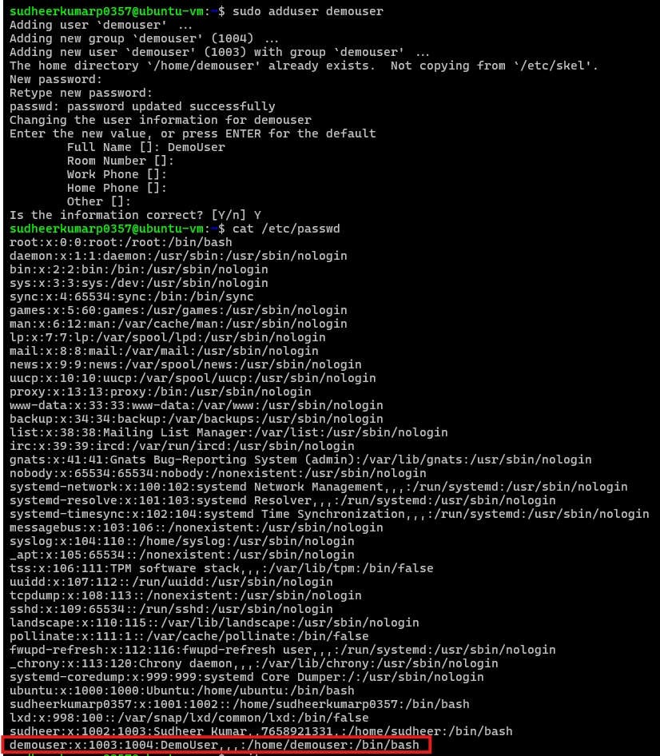

# User Management

## Adding a New User
To create a new user on a Linux system, you can use one of the following commands:

### Interactive User Creation
```bash
# Adding a new user interactively, with prompts for additional information and password setup
sudo adduser userName
```

### Non-Interactive User Creation
```bash
# Adding a new user in non-interactive mode (minimal setup)
sudo useradd userName
```

> Refer to the image below for an example of the `adduser` command output.
> 


## Logging In as the Newly Created User
After creating the user, follow these steps to generate SSH keys and set up secure access:

1. **Connect to the New User**:
   - Switch to the new user in the terminal where the user was created:
     ```bash
     su - userName
     ```

2. **Generate SSH Keys**:
   - Run the following command to create an SSH key pair:
     ```bash
     ssh-keygen
     ```
   - The command will prompt for a file path and passphrase. Press *Enter* to use the default path and skip the passphrase if not needed.

3. **Verify the Key Files**:
   - Navigate to the `.ssh` directory and list the files:
     ```bash
     cd ~/.ssh/
     ls
     ```
   - Ensure `id_rsa` (private key) and `id_rsa.pub` (public key) are present.

4. **Set Up `authorized_keys`**:
   - Create the `authorized_keys` file and copy the public key into it:
     ```bash
     cp ~/.ssh/id_rsa.pub ~/.ssh/authorized_keys
     ```

5. **Adjust File Permissions**:
   - Set strict permissions to secure the `authorized_keys` file:
     ```bash
     chmod 600 ~/.ssh/authorized_keys # Read and write only for the user
     chmod 700 ~/.ssh # Secure the .ssh directory
     ```

6. **Transfer the Private Key**:
   - Copy the private key (`~/.ssh/id_rsa`) to your local machine and make note of its path. Ensure the private key file has the correct permissions:
     ```bash
     chmod 600 ~/.ssh/id_rsa # Only the user can read the file
     ```

7. **Connect Remotely**:
   - Use the private key to connect to the remote user:
     ```bash
     ssh -i <private_key_path> userName@<ip_address>
     ```
   - Example:
     ```bash
     ssh -i ~/.ssh/id_rsa demouser@35.208.251.73
     ```
